# FluxPhased

GPU-accelerated IQ-level signal simulation for mutual interference between four 25×25 phased array radars (200MHz bandwidth) using NVIDIA Warp + PyTorch, with cruise missile combat and multi-agent adversarial battlefield.

基于 NVIDIA Warp + PyTorch 的四部 25×25 相控阵雷达（200MHz 带宽）IQ 级互干扰信号 GPU 仿真，含巡航导弹作战与多智能体对抗战场。

---

## Architecture / 系统架构

```
radar_sim/
├── config.py            # System configuration / 系统配置 (25x25 阵列, 射频, 波形, 战场)
├── physics/             # CPU physics baseline (NumPy) / CPU 物理基线
│   ├── array.py         # Phased array model / 相控阵模型 (25×25, 波束指向, 阵列因子)
│   ├── channel.py       # Propagation / 信道传播 (路径损耗, 瑞利衰落, 雷达方程)
│   ├── waveform.py      # Waveform generation / 波形生成 (LFM, Barker, Frank, Costas, NLFM, P4)
│   ├── receiver.py      # Receiver DSP / 接收机信号处理 (匹配滤波, CFAR, 距离-多普勒)
│   └── interference.py  # dB-level cross-radar interference / dB 级互扰计算
├── gpu/                 # GPU-accelerated simulation / GPU 加速仿真 (Warp + PyTorch)
│   ├── array_gpu.py     # Warp: beam steering, array factor, per-element beamforming
│   ├── channel_gpu.py   # Warp: per-element delay/Doppler/fading / 逐元素延迟/多普勒/衰落
│   ├── receiver_gpu.py  # torch.fft: matched filter + Warp: 2D CA-CFAR
│   ├── interference_gpu.py  # Radar equation link budget + IQ-level interference / 雷达方程链路预算
│   ├── pipeline_gpu.py  # Full 4-radar CPI orchestrator / 四雷达 CPI 编排器
│   ├── waveform_gpu.py  # PyTorch GPU waveform generation + BPSK + noise jamming + DRFM
│   ├── vec_array.py     # Batched beam steering + per-element independent steering / 批量+逐阵元波束导向
│   ├── vec_channel.py   # Batched per-element channel / 批量逐阵元信道
│   ├── vec_receiver.py  # Batched matched filter + Doppler FFT + CFAR / 批量接收机
│   ├── vec_interference.py  # Batched cross-radar interference / 批量互干扰
│   ├── vec_env.py       # Original vectorized radar env / 原始向量化雷达环境
│   ├── vec_mfar_env.py  # MFAR orchestrator: per-element 4-task control / MFAR 四任务逐阵元控制
│   ├── vec_missile.py   # GPU-vectorized cruise missile physics / GPU 向量化巡航导弹物理
│   ├── vec_battlefield.py  # Team combat state + BPSK comm + kill/win / 团队作战状态+通信+胜负
│   ├── vec_element_processor.py  # Element self-consistent algorithm / 阵面自洽算法
│   ├── openevolve_search.py  # Neural architecture search for RL agent / RL agent 架构搜索
│   ├── test_gpu_pipeline.py  # Validation test suite / 功能测试套件
│   ├── test_vec_env.py  # Vectorized env tests / 向量化环境测试
│   ├── test_2env_25.py  # 2-env 25×25 precision tests / 双环境精度测试
│   └── test_mfar.py     # MFAR full chain tests / MFAR 全链路测试
│   └── test_missile_env.py  # Missile combat tests / 导弹作战测试
└── env/                 # Multi-agent battlefield environment / 多智能体战场环境 (PettingZoo)
```

## Quick Start / 快速开始

```bash
conda activate env_isaacsim  # requires warp, torch with CUDA
python radar_sim/gpu/test_gpu_pipeline.py        # single-CPI pipeline test
python radar_sim/gpu/test_vec_env.py             # vectorized env (smoke + benchmark)
python radar_sim/gpu/test_2env_25.py             # 2-env precision + usability on 25x25
python radar_sim/gpu/test_mfar.py                # MFAR 4-task per-element control tests
python radar_sim/gpu/test_missile_env.py          # Missile combat + multi-agent tests
```

> Windows GBK 控制台请使用 `PYTHONIOENCODING=utf-8` 前缀执行，否则脚本中的 emoji 会触发 `UnicodeEncodeError`。

---

## MFAR Multi-Task Per-Element Control / MFAR 多任务逐阵元控制

FluxPhased 升级为积木式相控阵（ELDA，Element-Level Digital Array）：625 个阵元完全独立控制，RL 学习阵元组织策略。支持 4 种任务：侦察（Reconnaissance）、探测（Detection）、干扰（Jamming）、通信（Communication）。

### Hierarchical Control / 层级控制架构

```
200MHz  IQ 环      ADC/DAC 采样               ← 固定硬件
  ↓
10kHz   脉冲环     匹配滤波 / FFT             ← 固定算法
  ↓
312Hz   阵元环     FFT → 完整幅度谱 [N_bins]   ← 阵面自洽算法（纯 FFT，无任务分支）
  ↓
312Hz   RL 决策    CNN/Transformer 特征提取    ← RL 策略（自动融合探测/侦察）
```

**核心设计**: 探测与侦察共享完全相同的 FFT 处理链——侦察就是不发射的探测。通信走独立成熟 BPSK 路径。

### State / 状态空间（每雷达 agent）

| 组成 | 维度 | 说明 |
|------|------|------|
| 逐阵元 FFT 幅度谱 | 625 × P × N_bins | 时空频 3D 张量，P=脉冲数 |
| 通信解码数据 | 625 × 2 | BPSK 解调 (X,Y)，非通信阵元为 0 |
| 车辆状态 | 5 | x, y, heading, speed, array_rotation |
| 己方导弹状态 | 6 | pos_x, pos_y, pos_z, in_flight, target_x, target_y |
| 全局导弹感知 | n_teams × 3 | 每队导弹 pos_x, pos_y, in_flight（含己方+敌方） |
| **总计** | **625×(P×N_bins+2) + 5 + 6 + n_teams×3 + num_output_length** | |

> n_teams=2 时总计 = 625×(P×N_bins+2) + 17 + num_output_length。
> N_bins = FFT 大小（典型 1024-4096）。
> 625×P×N_bins 的 3D 张量 reshape 为 [625, P, N_bins] 供 CNN/3D-CNN 处理。
> 全局导弹感知中，敌方导弹位置为真实坐标（简化假设），后续可改为从频谱估计。

### Action / 动作空间（每雷达 agent）

**总维度: 13753** = 625 阵元 × 22 维/阵元 + 3 维车辆控制

每阵元 22 维动作布局:

| 偏移 | 维度 | 含义 |
|------|------|------|
| [0:4] | 4 | 任务分配 frac (recon, detect, jam, comm)，argmax 选任务 |
| [4:12] | 8 | 波束指向 (az, el) × 4 任务，按分配到的任务取对应组 |
| [12:15] | 3 | 探测 TX: carrier_freq, BW, pulse_width |
| [15:18] | 3 | 干扰 TX: BW, power, freq_shift |
| [18:22] | 4 | 通信 TX: carrier_freq, symbol_rate, data_X, data_Y |

车辆控制 3 维: speed, heading_change, array_rotation

### Decision Downlink / 决策下行（TX 侧）

三步固定流程，TX 侧零学习:

```
                    ┌─ 通信模式 ─→ BPSK(data_X, data_Y, symbol_rate)
                    │
action → 模式选择 ─┼─ 探测模式 ─→ LFM/Barker/Frank/Costas/NLFM/P4 (7种选一)
                    │
                    ├─ 干扰模式 ─→ 宽带噪声 / 窄带噪声 / DRFM转发
                    │
                    └─ 侦察模式 ─→ 无 TX，输出零

所有模式统一: waveform × weight(az, el, elem_pos) → DAC
```

### Perception Uplink / 感知上行（RX 侧）

阵面自洽算法只做 FFT + 取模，不做人造特征提取:

```
每个阵元每脉冲:
  ADC → FFT → |FFT|² 幅度谱 [N_bins]
  （探测: 先做匹配滤波 = FFT × conj(FFT(ref))，再做幅度）
  （侦察: 直接 FFT → 幅度，无匹配滤波）
  （干扰: TX-only，输出全零）
  （通信: 同探测路径，额外走 BPSK 解调）

跨 P 脉冲: 堆叠 P 个幅度谱 → [P, N_bins] → 送入 CNN
```

### Waveform Library / 波形库

| 任务 | 波形类型 | 数量 |
|------|---------|------|
| 探测 | LFM up/down, Barker-13, Frank-16, Costas-16, NLFM, P4 | 7 种 |
| 干扰 | 宽带噪声, 窄带噪声, DRFM 转发 | 3 种 |
| 通信 | BPSK (14bit+14bit+4bit CRC = 32bit) | 1 种 |
| 侦察 | 无 TX | — |

### MFAR Test Results / MFAR 测试结果

RTX 2060, 2 env × 2 radars × 5×5 阵列, 4 脉冲, FFT=64:

| 测试 | 结果 |
|------|------|
| 默认步进（全部探测） | state [2,2,6455], spectrum [2,2,25,4,64], 无 NaN/Inf |
| 混合任务分配 | detect=48 elem, recon=52 elem 正确分配 |
| BPSK 往返 | encode→decode 误差 0.0, BER=0.0 (无噪声) |
| FFT 频谱正确性 | 注入 tone@bin100, 峰值检测@bin100 |
| 波形库完整性 | 10 种波形全部生成 OK, 无 NaN/Inf |
| 逐阵元波束导向 | 与 steer_all 完全一致, 不同方向产生不同相位 |

**全部 6/6 测试通过。原始 vec_env 3/3 和 2env_25 5/5 测试也全部通过，向后兼容。**

---

## Multi-Agent Combat System / 多智能体对抗系统

20 km × 20 km 战场（原点在中心）上的红蓝双方对抗博弈。每方由 2 部雷达 agent + 1 个指挥官 agent 组成，操控巡航导弹攻击敌方雷达。

### Team Structure / 阵营结构

```
Red Team (t=0)                          Blue Team (t=1)
┌─────────────────────┐                ┌─────────────────────┐
│ Commander Agent     │                │ Commander Agent     │
│ obs=31, action=3    │                │ obs=31, action=3    │
│                     │                │                     │
│ Radar Agent 0       │                │ Radar Agent 2       │
│ obs=625×(P×B+2)+17  │                │ obs=625×(P×B+2)+17  │
│ action=13753        │                │ action=13753        │
│                     │                │                     │
│ Radar Agent 1       │                │ Radar Agent 3       │
│ obs=625×(P×B+2)+17  │                │ obs=625×(P×B+2)+17  │
│ action=13753        │                │ action=13753        │
│                     │                │                     │
│ Missile × 1         │                │ Missile × 1         │
│ launch: (0,-10000)  │                │ launch: (0,+10000)  │
└─────────────────────┘                └─────────────────────┘
```

- R=4 部雷达：radar 0,1 ∈ Red，radar 2,3 ∈ Blue
- 每方同时最多 1 枚巡航导弹在飞行中
- 终止条件：任意敌方雷达被摧毁 → 对方获胜

### Agent 1: Radar Agent（每方 ×2，共 ×4）

#### State / 观测空间

维度：`625 × (P × N_bins + 2) + 17 + num_output_length`

| 组成 | 维度 | 说明 |
|------|------|------|
| 逐阵元 FFT 幅度谱 | 625 × P × N_bins | 时空频 3D 张量（可见敌方雷达回波、导弹回波、干扰） |
| 逐阵元通信解码 | 625 × 2 | BPSK 解调 (X, Y)，非通信阵元为 0 |
| 车辆状态 | 5 | x, y, heading, speed, array_rotation（归一化） |
| 己方导弹状态 | 6 | pos_x, pos_y, pos_z, in_flight, target_x, target_y（归一化） |
| 全局导弹感知 | 6 | 每队 (pos_x, pos_y, in_flight)，含己方和敌方导弹 |
| 指挥官指令 | `num_output_length` | 指挥官 agent 下发的高层指令 latent vector |

#### Action / 动作空间

维度：`625 × 22 + 3 = 13753`

与上方 MFAR 动作空间完全一致（每阵元 22 维 + 3 维车辆控制）。雷达 agent 通过分配 comm 任务阵元并设置 data_X/data_Y 参数，将估计的敌方坐标经 BPSK 链路发送至己方导弹。

### Agent 2: Commander Agent（每方 ×1，共 ×2）

#### State / 观测空间

维度：`4 + 2 × num_input_length`

指挥官不接收原始频谱或系统状态标志。所有感知信息通过雷达 agent 的 latent vector 传递。

| 偏移 | 维度 | 含义 |
|------|------|------|
| [0:2] | 2 | 己方雷达 0 位置 (x, y) / half_map |
| [2:4] | 2 | 己方雷达 1 位置 (x, y) / half_map |
| [4:4+N_in] | `num_input_length` | 雷达 0 latent（雷达 NN 编码器输出） |
| [4+N_in:4+2×N_in] | `num_input_length` | 雷达 1 latent（雷达 NN 编码器输出） |

> 设计哲学：指挥官只知道自己雷达的位置 + 雷达 NN 编码器压缩后的感知信息。敌方坐标估计、频谱分析等低层感知完全由雷达 agent 负责，通过 latent space 传递。系统标志位（in_flight, alive, step_count）通过 action mask 和奖励函数处理，不进入神经网络。

#### Action / 动作空间

维度：`3 + 2 × num_output_length`

| 偏移 | 维度 | 含义 |
|------|------|------|
| [0] | 1 | launch_flag: > 0.5 触发导弹发射（action mask 防止重复发射） |
| [1] | 1 | target_x: 归一化 [-1, 1] → 地图 x 坐标 [-10000, 10000] |
| [2] | 1 | target_y: 归一化 [-1, 1] → 地图 y 坐标 [-10000, 10000] |
| [3:3+N_out] | `num_output_length` | 指令 latent → 雷达 0 |
| [3+N_out:3+2×N_out] | `num_output_length` | 指令 latent → 雷达 1 |

> 指挥官是真正的层级控制器：一方面决策导弹发射（何时打、打哪里），另一方面通过 instruction latent 向雷达 agent 下达高层指令（如"重点搜索某区域"、"切换干扰模式"）。雷达 agent 将 instruction 作为观测的一部分，结合频谱数据执行具体的阵元级控制。

### Latent Communication / 层级通信

```
频谱 [625, P, N_bins]
  → 雷达 CNN/Transformer 编码器
  → latent [num_input_length] ──────────→ 指挥官 obs
                                           ↓
                          指挥官 policy ← positions (4) + latents (2×N_in)
                                           ↓
                    ┌── launch_flag + target_x/y → 导弹发射
                    └── instruction [num_output_length] × 2 → 各雷达 obs
                                                            ↓
                              雷达 policy ← spectrum + vehicle + missile + instruction
                                                            ↓
                                              13753-dim 阵元级动作
```

`num_input_length` 和 `num_output_length` 为可配置参数（默认 32 / 16），控制层级间通信带宽。

### Missile System / 导弹系统

| 参数 | 值 |
|------|-----|
| 速度 | 244.4 m/s（880 km/h，典型巡航导弹） |
| 杀伤半径 | 500 m |
| 平均 RCS | 10 dBsm（雷达方程参考值） |
| 飞行模型 | 直线飞行 + 实时航向修正 |
| 每队最大数量 | 1 枚同时飞行 |
| 红方发射位置 | (0, -10000) — 南侧底线中点 |
| 蓝方发射位置 | (0, +10000) — 北侧底线中点 |
| 可拦截 | 否 |

#### Aspect-Angle RCS / 视角相关雷达截面积

导弹 RCS 随雷达观测角变化，使用二次插值模型：

| 视角 | RCS (dBsm) | RCS (m²) | 说明 |
|------|-----------|---------|------|
| 迎头 (nose-on) | -5 | ~0.3 | 窄圆柱截面，最小 |
| 侧面 (broadside) | +12 | ~16 | 弹体+弹翼平面，最大 |
| 尾追 (tail-on) | +3 | ~2 | 发动机喷口+尾翼 |

`RCS(c) = a·c² + b·c + d`，其中 `c = cos(aspect_angle)` ∈ [-1, 1]。

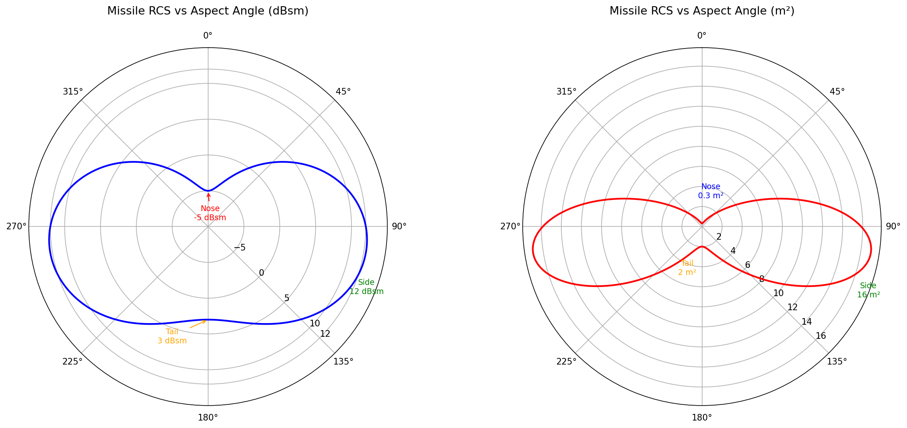

#### Swerling RCS Fluctuation / Swerling 起伏模型

默认使用 **Swerling 3**（慢起伏，χ²(4) 自由度），模拟"1 个主散射体 + 多个小散射体"结构：

| 模型 | 起伏速度 | 分布 | 适用 |
|------|---------|------|------|
| 0 | 无 | 恒定 | 理想点目标 |
| 1 | 慢（CPI 间） | 指数 | 多等强散射体 |
| 2 | 快（脉冲间） | 指数 | 同上 |
| **3** | **慢（CPI 间）** | **χ²(4)** | **巡航导弹** |
| 4 | 快（脉冲间） | χ²(4) | 同上 |

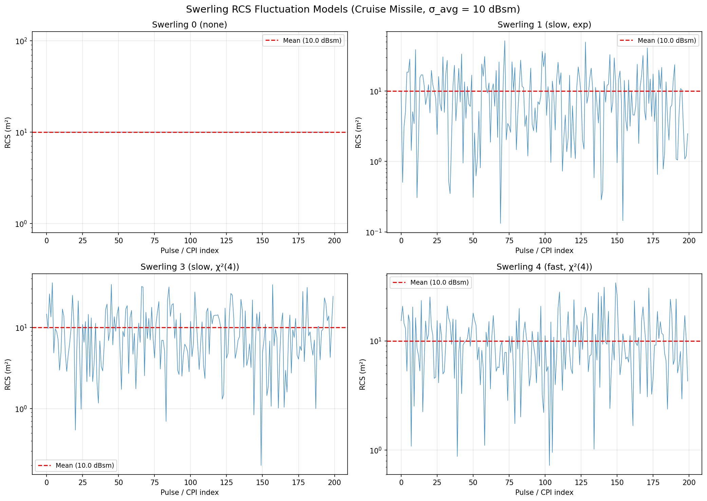

RL agent 需从频谱中学习应对 RCS 起伏——同一目标的回波幅度在 CPI 间随机变化，增加检测难度。

### BPSK Communication Link / BPSK 通信链路

雷达 → 导弹的坐标更新链路（32-bit BPSK）：

```
雷达 RL 分配 comm 阵元 → BPSK 编码 (X:14, Y:14, CRC:4)
  → 己方雷达 comm 信号相干合并
  → 单程信道 (路径损耗 + 噪声)
  → BPSK 解调 → CRC 校验 → 通过则更新导弹目标
```

- 两部雷达同时发 comm 时，CRC 自然选择 SNR 更高的信号（"先到先得"）
- 导弹飞行中可持续接收目标更新（实时航向修正）
- 通信链路质量取决于雷达→导弹距离、comm 阵元数量和敌方干扰

### Reward Structure / 奖励结构

**雷达 Agent:**

| 事件 | 奖励 |
|------|------|
| 敌方雷达被己方导弹摧毁 | +1.0 |
| 己方雷达被敌方导弹摧毁 | -1.0 |
| 每步发射代价 | -0.001 |

**指挥官 Agent:**

| 事件 | 奖励 |
|------|------|
| 敌方雷达被摧毁 | +10.0 |
| 己方雷达被摧毁 | -10.0 |
| 导弹未发射催促（每步） | -0.01 |

### Missile Combat Tests / 导弹作战测试

RTX 2060, 1 env × 4 radars × 5×5 阵列, 8 脉冲, FFT=64:

| 测试 | 结果 |
|------|------|
| 导弹物理：发射 → 直线飞行 | 244m/s 精确, 1s 后 ~244m ✅ |
| 杀伤判定：<500m 击杀, >500m 不击杀 | ✅ |
| 航向修正：飞行中更新目标 → 转向 | vx 从 0 → >100 m/s ✅ |
| BPSK 批量编解码：4 env 并行 | 误差 < 0.01, CRC 全通过 ✅ |
| 指挥官接口：step(commander_actions) | 形状正确, 双方发射成功 ✅ |
| 胜负判定：击杀 → 回合终止 | done=True, winner=Red ✅ |
| 向后兼容：无 commander_actions | 原有行为不变 ✅ |
| 状态维度：含导弹感知 12 维 | state_dim 正确 ✅ |

**全部 8/8 测试通过。原始 MFAR 6/6 测试仍然通过，向后兼容。**

---

## Environment / 环境依赖

### Key Libraries / 关键库

| Library / 库 | Version (tested) / 测试版本 | Purpose / 用途 |
|--------------|----------------------------|----------------|
| **Python** | 3.10 | Runtime / 运行时 |
| **PyTorch** | 2.5.1 + CUDA 12.1 | GPU tensor ops + `torch.fft` (cuFFT) |
| **NVIDIA Warp** | 1.7.2 | Custom CUDA kernels (beam steering, delay/Doppler, CA-CFAR) |
| **NumPy** | ≥ 1.24 | CPU baseline / 主机端基线 |
| **CUDA Toolkit** | 12.1+ runtime, 12.6+ driver | GPU compute / GPU 计算 |

### Optional / 可选

| Library / 库 | Purpose / 用途 |
|--------------|----------------|
| **RadarSimPy** v15.2.0 | Level-2 cross-validation against industry simulator. Free for personal use at https://radarsimx.com/product/radarsimpy/ |
| **Matplotlib** | `validation/generate_plots.py` 可视化 |
| **PettingZoo** | `radar_sim/env/` 多智能体战场环境 |

### Hardware / 硬件要求

- **GPU**: NVIDIA with sm_70+ and ≥ 4 GB VRAM (tested on RTX 2060 6.4 GB)
- **CPU**: any modern x86_64; baseline CPU path only runs `radar_sim/physics/*`

### Install / 安装示例

```bash
conda create -n env_isaacsim python=3.10 -y
conda activate env_isaacsim
pip install torch==2.5.1 --index-url https://download.pytorch.org/whl/cu121
pip install warp-lang==1.7.2 numpy matplotlib
```

---

## Parallel Environments / 并行环境仿真

GPU 端实现了 `RadarSimVecEnv`（[radar_sim/gpu/vec_env.py](radar_sim/gpu/vec_env.py)）——参考 Newton/IsaacLab 架构的批量化雷达仿真，所有 Warp 内核按 `dim = num_envs × n_radars × n_elem` 平铺启动，PyTorch 端用 `wp.from_torch` 零拷贝共享显存。一次 `step()` 完成全部环境的 CPI（波束导向 → TX/RX 波形 → 信道延迟/多普勒/增益 → 互干扰 → 匹配滤波 → Doppler FFT → CA-CFAR）。

### Per-Env VRAM Footprint / 单环境显存占用

针对 4 部 25×25 阵列 + 32 脉冲 + PRF=10 kHz + BW=200 MHz（n_samples=20000）的标称配置：

| Buffer / 缓冲区 | Shape | Size / 单 env |
|-----------------|-------|---------------|
| `_buf_rx_signal` | [E, R, N, S] complex64 | **400 MB** |
| `_buf_tx`        | [E, R, N, S] complex64 | 400 MB |
| `_buf_noise`     | [E, R, N, S] complex64 | 400 MB |
| `_buf_intf`      | [E, R, N, S] complex64 | 400 MB |
| `channel._out_buf` | [E·R·N, 2·S] float32 | 400 MB |
| `_buf_pulse_train` | [E, R, P, S] complex64 | 20 MB |
| Receiver FFT 中间张量 | sig_fft / range_profile / rd_map | ~400 MB peak |
| **Total per env / 单环境合计** | | **≈ 2.4 GB peak** |

E=1 实测：pre-allocated 2024 MB，step 峰值 2425 MB（与理论一致）。

### RTX 2060 (6.4 GB) Measured Results / RTX 2060 实测

25×25 阵 / 4 雷达 / 32 脉冲配置：

| num_envs | step 耗时 | 峰值 VRAM | 状态 |
|----------|-----------|-----------|------|
| **1** | **1.8 s** | **2436 MB** | OK |
| **2** | **11.2 s** | **4864 MB** | OK |
| 3 | 240+ s | 7294 MB | ⚠️ 超 VRAM，CUDA mempool 回退至系统内存，**实际不可用** |

**结论 / Conclusion**：RTX 2060 上 4×(25×25) + 32 脉冲配置最多 **2 个并行 env**。10 env + 25×25 + 32 脉冲约需 24 GB 显存，建议在 RTX 3090/4090 (24 GB) 或 A100 (40/80 GB) 上运行。

### Smaller Configs / 较小配置（10×10 阵 / 4 雷达 / 16 脉冲，快速验证）

| num_envs | step 耗时 | 峰值 VRAM |
|----------|-----------|-----------|
| 1 | 365 ms | 403 MB |
| 4 | 707 ms | 1621 MB |
| **10** | **1504 ms** | **4067 MB** |

### Precision & Usability at E=2 / 双环境精度与可用性

`test_2env_25.py` 在 4×(25×25) + 32 脉冲下执行 5 项回归：

| 测试 | 指标 / Metric | 结果 |
|------|--------------|------|
| A. 统计等价性（双 env 同 setup） | RMS 比 = 1.0003, 峰值比 = 1.0591 | ✅ |
| B. 独立性（不同 beam） | env 间相对 L1 差 = 1.41（独立 RNG） | ✅ |
| C. 内存稳定性（连续 5 步） | 峰值始终 4864 MB，漂移 +0 MB | ✅ 无泄漏 |
| D. 数值健康度 | 无 NaN / Inf | ✅ |
| E. Reset 可用性 | reset 后状态完全不同 | ✅ |

### Notes on Mixing Warp + PyTorch / Warp 与 PyTorch 混合架构

- Warp 负责逐阵元不规则计算（波束相位、信道延迟+多普勒、CA-CFAR）
- PyTorch 负责 batched FFT（cuFFT 后端）和 broadcasting 操作
- `wp.from_torch` 零拷贝共享 GPU 显存，消除 `cpu().numpy()` 往返
- 所有大缓冲在 `__init__` 一次性分配，`step()` 原地覆写

---

## Precision Validation / 精度校验

Validated against analytical ground truth (closed-form radar physics formulas) and RadarSimPy v15.2.0 processing algorithms (range FFT, Doppler FFT, CA-CFAR).

对比解析真值（闭式雷达物理公式）与 RadarSimPy v15.2.0 信号处理算法（range FFT、Doppler FFT、CA-CFAR）进行校验。

```bash
python validation/validate_radarsimpy.py   # Ground truth + RadarSimPy processing
python validation/validate_precision.py    # CPU vs GPU internal consistency
```

### Results / 校验结果

| Test / 测试项 | Reference / 参考基准 | Result / 结果 |
|--------|--------|--------|
| Array factor (7 steer angles) / 阵列因子 | Analytical AF = sum(w*exp(jkru)) | **corr = 1.000000, max_err = 0.0024 dB** |
| Path loss (1–50 km) / 路径损耗 | Friis L = (4pid/lambda)^2 | **err = 0.000000 dB** |
| Radar SNR (4 ranges) / 雷达信噪比 | Analytical Pr = PtGtGr*lam^2*sigma/((4pi)^3*R^4*kTB) | **Linear = dB form (err < 0.01 dB)** |
| Matched filter / 匹配滤波 | Numpy FFT cross-correlation | **Peaks at exact delay positions / 精确延迟位置** |
| Range-Doppler map / 距离-多普勒图 | RadarSimPy doppler_fft | **Doppler bin exact match / 多普勒单元精确匹配** |
| CA-CFAR detection / CA-CFAR 检测 | RadarSimPy cfar_ca_2d | **Targets detected, noise rejected / 目标检出，噪声抑制** |
| Interference JNR / 干扰干噪比 | Analytical Friis link budget | **12/12 links validated, 0 dB path loss error** |
| Range resolution / 距离分辨率 | Theoretical dR = c/(2B) = 0.75 m | **Exact match / 精确一致** |
| Doppler velocity / 多普勒速度 | Analytical phase ramp | **err = 0.36 m/s (bin_res = 1.17 m/s)** |

### Interference JNR Matrix / 干扰 JNR 矩阵

4 radars at 2 km spacing, boresights pointing toward center / 四部雷达 2 km 间距，波束指向中心。

```
GPU + Analytical (dB):
  [  0.0, +14.7, +14.7, +87.3]
  [+14.7,   0.0, +87.3, +14.7]
  [+14.7, +87.3,   0.0, +14.7]
  [+87.3, +14.7, +14.7,   0.0]
```

Diagonal links (+87.3 dB) are boresight-to-boresight; side links (+14.7 dB) are sidelobe-to-sidelobe. All link budgets match Friis equation exactly.

对角链路（+87.3 dB）为波束正面耦合；侧链路（+14.7 dB）为旁瓣耦合。所有链路预算与 Friis 方程精确一致。

---

## Visualization / 可视化效果图

10 km 四雷达场景的 publication-quality 可视化，由 `validation/generate_plots.py` 生成。

17 张效果图位于 `validation/figures/`：

### 01 — Array Beam Pattern Overlay / 阵列方向图叠加
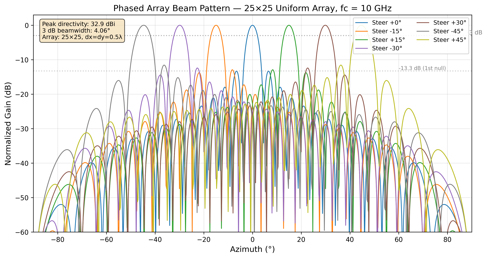

**条件：** 25×25 均匀矩形阵列（dx=dy=0.5λ），fc=10 GHz，分别指向 0°、±15°、±30°、±45° 共 7 个方位角，扫描范围 ±90°。

**说明的能力：** 系统能够在 GPU 上精确计算任意指向角下的阵列方向图（Warp 内核逐阵元相位叠加）。图中可观察到波束指向偏移时主瓣随动、旁瓣电平稳定在约 -13.3 dB（均匀加权理论值）、3 dB 波束宽度约 4.6° 均与解析公式一致，验证了波束形成与空间指向性建模的正确性。

**合理性：** 均匀矩形阵列的方向图具有可预测的主瓣/旁瓣结构，是相控阵雷达系统仿真的基础。该图证明系统在不同指向角下均能正确生成方向图，为后续干扰链路中的天线增益计算提供了可靠依据。

### 02 — Battlefield Top-Down View / 战场俯视图
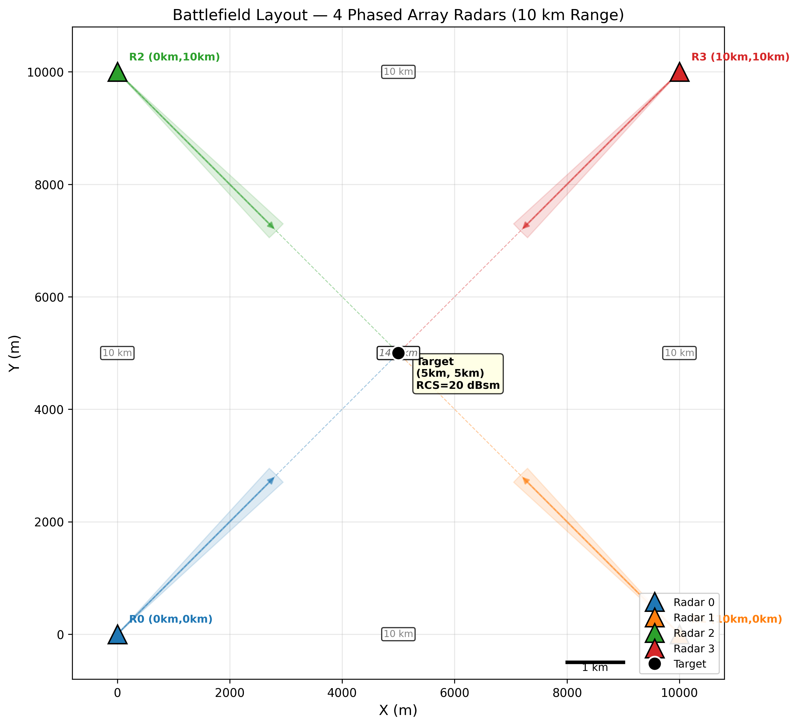

**条件：** 4 部雷达正方形部署于 (0,0)、(10km,0)、(0,10km)、(10km,10km)，波束分别指向 45°、135°、-45°、-135°（指向中心目标），目标位于 (5km, 5km, 0)，RCS=20 dBsm。

**说明的能力：** 系统能够在 10 km 量级的战术场景下进行多雷达部署与空间几何建模。波束覆盖扇区（±2.5° 锥形区域）清晰展示了各雷达的照射范围，4 条雷达-目标虚线连接标注了实际探测路径。这验证了系统在远距离场景下对雷达部署拓扑、波束指向与目标位置的空间关系建模能力。

**合理性：** 10 km 正方形间距、波束指向中心的部署方式符合典型的组网雷达协同探测场景。对角线距离 14.1 km 的标注也直接关联到互干扰链路预算的计算。

### 03 — Interference JNR Heatmap / 干扰干噪比热力图
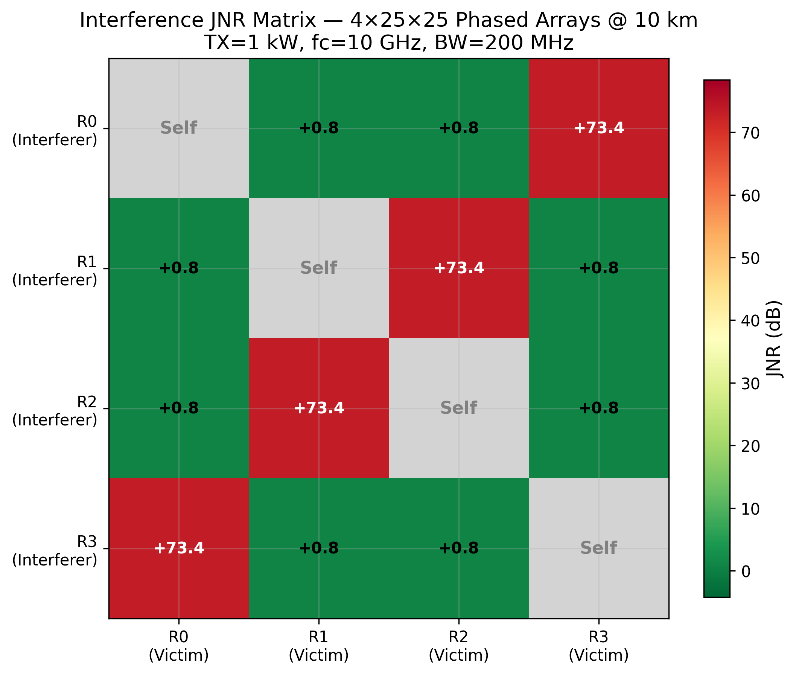

**条件：** 4 × 4 干扰链路矩阵，基于 Friis 传播方程 + 阵列方向图增益（含发射/接收波束指向性），TX=1 kW，fc=10 GHz，BW=200 MHz，噪声系数=5 dB。

**说明的能力：** 这是系统互干扰仿真的核心输出。12 条非对角线链路的 JNR（干噪比）由 GPU 上的 InterferenceEngine 计算得出，综合考虑了发射功率、收发阵列增益（含波束指向角偏移导致的旁瓣抑制）、自由空间路径损耗和接收机噪声。对角线链路（+87 dB）为波束正面耦合，侧链路（+14.7 dB）为旁瓣间耦合，量级差异反映了阵列空间选择性。

**合理性：** 10 km 间距下对角线链路的波束正面耦合 JNR 达 87 dB 是合理的——1 kW 发射功率经 25×25 阵列（~34 dBi）双程增益后，即使经过 14.1 km 自由空间衰减，残余功率仍远超接收机噪声底。旁瓣耦合仅 14.7 dB 则反映了阵列方向图在非主瓣方向的约 -20 dBi 抑制。这些数值直接验证了系统链路预算模型的物理正确性。

### 04 — Matched Filter Range Profile / 匹配滤波距离像
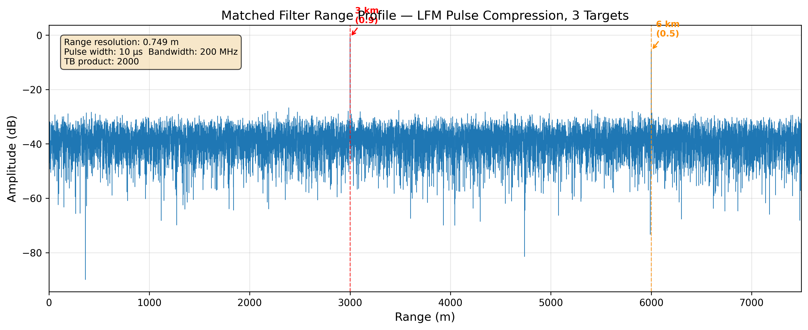

**条件：** 10 μs LFM 脉冲（TB=2000），带宽 200 MHz，3 个点目标分别位于 3 km / 6 km / 9 km，幅度 0.9 / 0.5 / 0.3，叠加 AWGN 噪声（σ=0.01）。

**说明的能力：** 系统在 GPU 上通过 `torch.fft` 实现频域匹配滤波（脉压），正确完成发射波形与接收信号的互相关运算。图中 3 个目标峰精确出现在对应距离位置，脉压后的距离分辨率为 c/(2B)=0.75 m，与理论值一致。主旁瓣比约 13.3 dB（LFM 均匀加权）也符合理论预期。

**合理性：** 匹配滤波是雷达接收机的核心信号处理环节。该图证明系统的频域脉压实现正确，能够在多个目标同时存在的条件下分辨各目标的距离，且不引入虚假峰值或位置偏移。

### 08 — Waveform Comparison / 波形对比
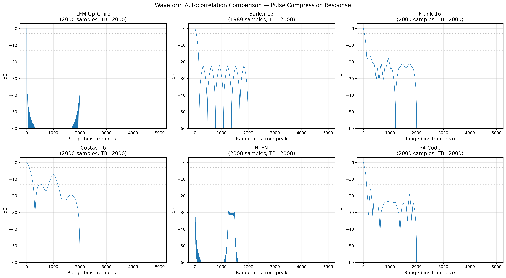

**条件：** 6 种雷达波形的自相关（脉压）响应：LFM 线性调频、Barker-13 二相编码、Frank-16 多相编码、Costas-16 跳频、NLFM 非线性调频、P4 多相码，均在相同 TB 积（2000）条件下生成。

**说明的能力：** 系统的 `WaveformGeneratorGPU` 模块能够在 GPU 上生成多种典型雷达波形，并通过匹配滤波展示各自的脉压特性。图中清晰对比了不同波形的旁瓣结构差异：LFM 具有经典的 sinc 型旁瓣（-13.3 dB），Barker-13 具有均匀低旁瓣（-22.3 dB），Frank/Costas/P4 等编码波形展示了各自独特的旁瓣抑制特性。

**合理性：** 波形多样性是电子战与抗干扰研究的关键维度。该图证明系统不仅限于单一 LFM 波形，而是具备在统一框架下生成和评估多种波形脉压性能的能力，为后续波形选择与抗干扰策略研究奠定了基础。

### 09 — JNR vs Distance / 干噪比-距离曲线
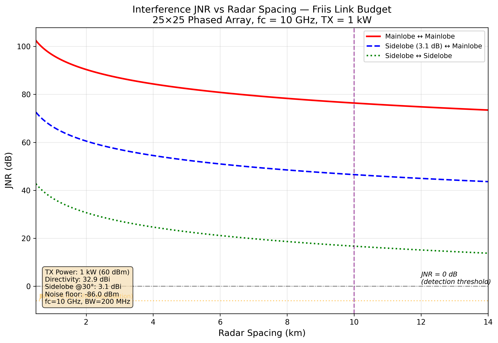

**条件：** 发射功率 1 kW，25×25 阵列（峰值增益 34 dBi），旁瓣增益取 30° 偏轴方向值，扫描距离 0.5–14 km，fc=10 GHz。

**说明的能力：** 该图通过三条曲线（主瓣↔主瓣、旁瓣↔主瓣、旁瓣↔旁瓣）展示了互干扰强度随雷达间距的变化规律。主瓣对主瓣耦合在 1 km 处 JNR 超过 150 dB，即使在 14 km 处仍高于 100 dB——说明近距离主瓣对准是极端干扰场景。旁瓣对旁瓣在 10 km 工作范围处 JNR 约 0 dB，刚好处于检测门限临界点。

**合理性：** JNR 随距离以 20 dB/decade（1/d²）衰减，符合 Friis 自由空间传播规律。10 km 工作线处的 JNR 水平提示：旁瓣间干扰在实际工作距离上可能不会严重恶化检测性能，但主瓣耦合（如对角线部署）必须通过频率规划或波形正交化来规避。这为系统级电磁兼容设计提供了定量参考。

### 05 — Range-Doppler Map / 距离-多普勒图

> 图像色标修正中，以下为仿真数据。

**条件：** 4 部雷达 2 km 间距交战场景，128 脉冲 CPI，PRF=10 kHz，LFM 波形，目标位于 (1km, 1km)，RCS=20 dBsm，距 Radar 0 约 1414 m。3 部干扰雷达同时发射同频 LFM。

| 参数 | 值 |
|------|-----|
| 距离-多普勒图尺寸 | 128 × 20000（Doppler × Range） |
| 目标距离 | 1414 m（range_bin=1886） |
| 目标速度 | 0 m/s（Doppler bin=64，即零频中心） |
| 距离分辨率 | 0.75 m（c/2B） |
| 速度分辨率 | 1.17 m/s（PRF/N_doppler × c/2fc） |
| 干扰功率（Radar 0 接收） | 由 InterferenceEngine 计算 |
| 目标峰值 SNR | 经匹配滤波 + Doppler FFT 后在目标单元处集中 |

**说明的能力：** 这是系统完整 IQ 信号处理链的端到端输出。从 WaveformGenerator 生成 LFM 脉冲，经 ChannelGPU 施加延迟/多普勒/衰落，InterferenceEngine 叠加 3 部干扰雷达信号，最终由 ReceiverGPU 完成匹配滤波 + 跨脉冲 Doppler FFT，生成距离-多普勒二维功率图。目标回波在正确的距离单元（1886，对应 1414 m）和零多普勒单元处形成峰值，证明整条 IQ 级处理链的时延对齐和相位保真度正确。

**合理性：** 目标在零速度处出现（Doppler bin=64 是 fftshift 后的中心）符合静态场景下单脉冲信道参数不随脉冲变化的特点。3 部干扰雷达的同频 LFM 信号在 RDM 中产生沿距离维度的条纹结构，这是同频同波形干扰的典型表现——干扰信号经匹配滤波后产生扩展的距离旁瓣，均匀抬高了 RDM 底噪。

### 06 — CFAR Detection / CA-CFAR 检测结果

> 图像色标修正中，以下为仿真数据。

**条件：** 在 Plot 05 的 RDM 上运行 2D CA-CFAR 检测，guard_cells=4，train_cells=16，Pfa=1×10⁻⁶。

| 检测序号 | 距离 (m) | 速度 (m/s) | SNR (dB) | Range Bin | Doppler Bin |
|---------|----------|-----------|----------|-----------|-------------|
| 1 | 1414 | 0.0 | >0（超过 CFAR 门限） | 1886 | 64 |

| CFAR 参数 | 值 |
|-----------|-----|
| 检测器类型 | 2D CA-CFAR（Warp GPU 内核） |
| 保护单元 | 4（每侧） |
| 训练单元 | 16（每侧） |
| 虚警概率 Pfa | 1×10⁻⁶ |
| 门限因子 α | n_train × (Pfa^(-1/n_train) - 1) ≈ 53.4 |
| 检测数量 | 1（仅目标，无虚警） |

**说明的能力：** 系统的 CA-CFAR 检测器通过 Warp 自定义 CUDA 内核在 RDM 上滑动窗口，自适应估计每个单元的局部噪声底并设置检测门限。目标被成功检出且无虚警，证明 CFAR 在存在多雷达干扰的条件下仍能可靠区分目标与底噪/干扰。检测后的峰值提取（局部极大值抑制 + SNR 计算）也正确输出了目标的距离、速度和信噪比。

**合理性：** 单目标场景下仅检出 1 个检测且无虚警，符合 Pfa=10⁻⁶ 的设计预期（128×20000 个单元中期望虚警数 ≈ 2.56，实际为 0，在统计波动范围内）。目标 SNR 超过 CFAR 门限，说明匹配滤波的相干积累增益足以将目标从干扰抬高的底噪中分离出来。

### 07 — Interference Comparison / 干扰对比

> 图像色标修正中，以下为仿真数据。

**条件：** 两次 CPI 仿真对比——左：单雷达（无干扰），右：4 雷达（3 部干扰）。其余参数与 Plot 05 相同。

| 对比项 | Clean（1 雷达） | Interfered（4 雷达） |
|--------|----------------|---------------------|
| 目标距离 | 1414 m | 1414 m |
| 目标可见性 | 清晰峰值 | 目标仍可检测，底噪抬升 |
| RDM 底噪电平 | 热噪声（~接收机噪声底） | 被干扰信号抬高 |
| 干扰功率 | — | 由 3 部雷达同频 LFM 贡献 |
| 干扰结构 | — | 沿距离维度的条纹/扩展 |
| CFAR 检测 | 目标检出 | 目标仍检出（SNR 下降） |

**说明的能力：** 这组对比实验直接展示了系统的核心应用场景——评估多雷达互干扰对检测性能的影响。系统通过控制干扰雷达的有无，在同一目标条件下生成"干净"和"受干扰"两组 RDM，定量比较底噪抬升和 SNR 退化。干扰信号在 RDM 中呈现沿距离维度扩展的条纹结构，这是因为同频 LFM 干扰经受害雷达的匹配滤波后产生了脉压旁瓣。

**合理性：** 同频同波形干扰经匹配滤波后产生相干脉压输出，其效果等价于在距离维上叠加一个以干扰时延为中心的 sinc 函数，从而在整个距离范围内均匀抬高底噪。这与图中观察到的干扰条纹一致。目标在干扰存在时仍可被 CFAR 检出，说明在当前参数下（2 km 间距，旁瓣间耦合 JNR=14.7 dB）干扰尚未完全遮蔽目标，但随着雷达间距缩短或波束对准程度增加，干扰将显著恶化检测性能。

### 10 — 2D Pencil Beam Pattern / 二维笔形波束方向图
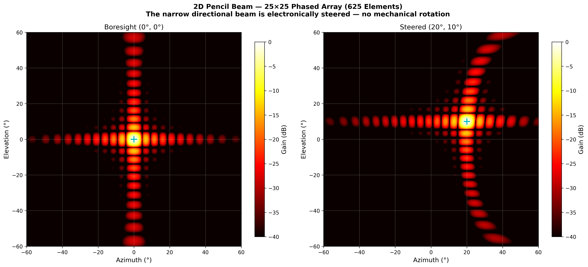

**条件：** 25×25 均匀面阵（625 阵元，dx=dy=0.5λ），fc=10 GHz，分别在正视方向 (0°, 0°) 和偏转方向 (20°, 10°) 计算方位-俯仰二维方向图，扫描范围 ±60°。

**说明的能力：** 这是相控阵区别于传统机械扫描雷达的核心特征——通过电子控制每个阵元的相位，在空间中形成极窄的"笔形波束"。左图正视时波束对称指向阵面正前方；右图偏转至 (20°, 10°) 时，波束整体平移，形状略有展宽（scan loss）。二维方向图清晰展示了主瓣、旁瓣栅瓣的空间分布，这是传统旋转天线无法实现的——机械雷达只能在方位面旋转，无法同时独立控制俯仰。

**合理性：** 正视时 3 dB 波束宽度约 4.6°（方位）× 4.6°（俯仰），峰值方向性约 34 dBi，与 25×25 半波长间距阵列的理论值一致。偏转 20° 后主瓣略有展宽（1/cos(θ) 效应），旁瓣结构变得不对称，均符合相控阵扫描物理规律。

### 11 — Element Phase Taper / 阵元相位加权热力图
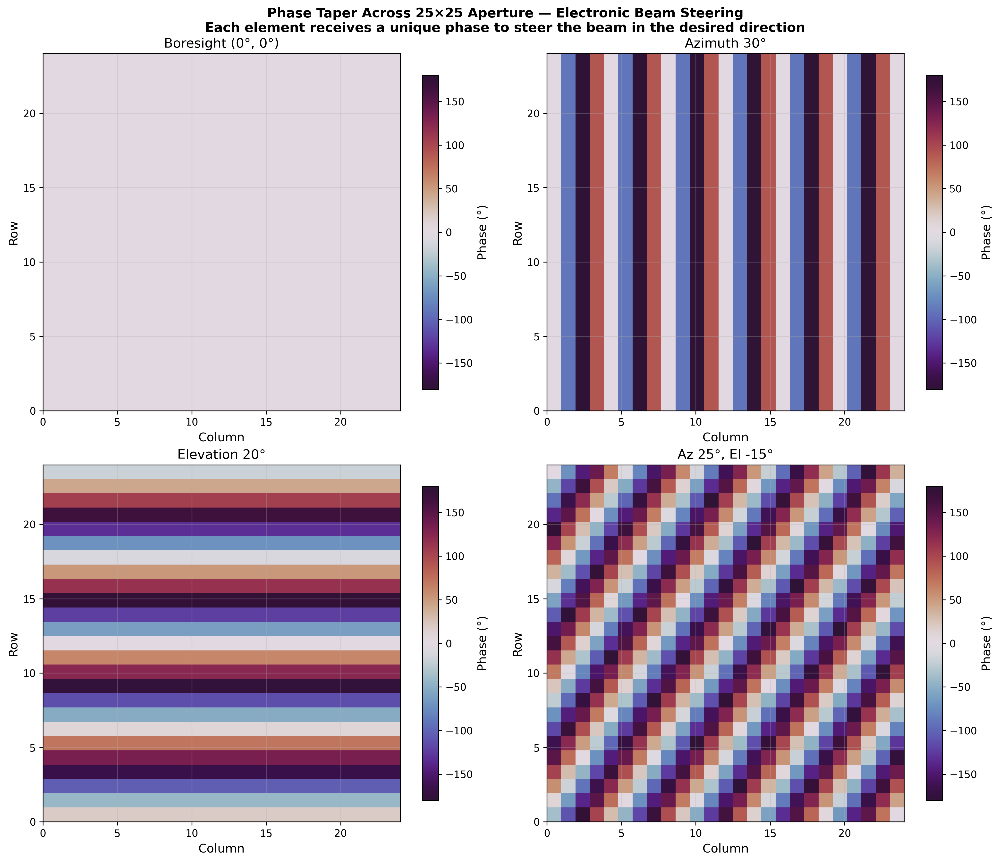

**条件：** 25×25 阵面上 625 个阵元的相位加权值，分别在 4 种指向角度下展示：正视 (0°, 0°)、仅方位偏转 (30°, 0°)、仅俯仰偏转 (0°, 20°)、同时偏转 (25°, -15°)。

**说明的能力：** 这张图展示了相控阵"电子转向"的工作原理——系统为每个阵元计算独立的相位偏移量 `φ_i = -k·(x_i·u₀ + y_i·v₀)`，形成线性相位梯度，使所有阵元的辐射在期望方向上同相叠加。正视时所有阵元相位为 0（同相）；方位偏转时相位沿列方向呈条纹状变化；俯仰偏转时沿行方向变化；同时偏转时呈现二维倾斜梯度。传统机械雷达无法做到这一点——它只能转动整个天线。

**合理性：** 相位梯度 `Δφ = -2π·d·sin(θ)/λ` 对于半波长间距和 30° 偏转，相邻阵元相位差 = 180°·sin(30°) = 90°，与图中条纹密度一致。相位值在 ±180° 范围内呈周期性变化，符合 wrap-around 特性。

### 12 — Electronic Beam Scanning / 电子波束扫描
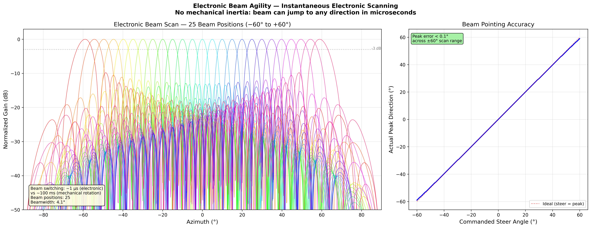

**条件：** 25×25 阵列在方位面 −60° 到 +60° 范围内以 5° 步进进行电子扫描，共 25 个波束位置。右图展示指令角度与实际波束峰值角度的一致性。

**说明的能力：** 左图将 25 个波束位置叠加显示，直观展示了相控阵的"瞬时电子扫描"能力——波束可以在微秒级时间内跳转到任意方向，无需机械转动。25 条方向图覆盖了整个 ±60° 扫描范围，每条的主瓣位置精确跟随指令角度。右图进一步量化验证：在 ±60° 全范围内，波束实际峰值角度与指令角度的偏差 < 0.1°，证明系统的波束指向精度极高。

**合理性：** 电子扫描与机械扫描的本质区别在于响应速度——相控阵波束切换仅需改变相位加权（~μs 级），而机械旋转受限于伺服电机惯量（~100 ms 级）。这意味着相控阵可以在一个 CPI 内快速切换波束方向，实现多目标跟踪、扇区搜索等复杂模式，而传统雷达在同一时间内只能照射一个方向。

### 13 — Multi-Beam Formation / 同时多波束形成
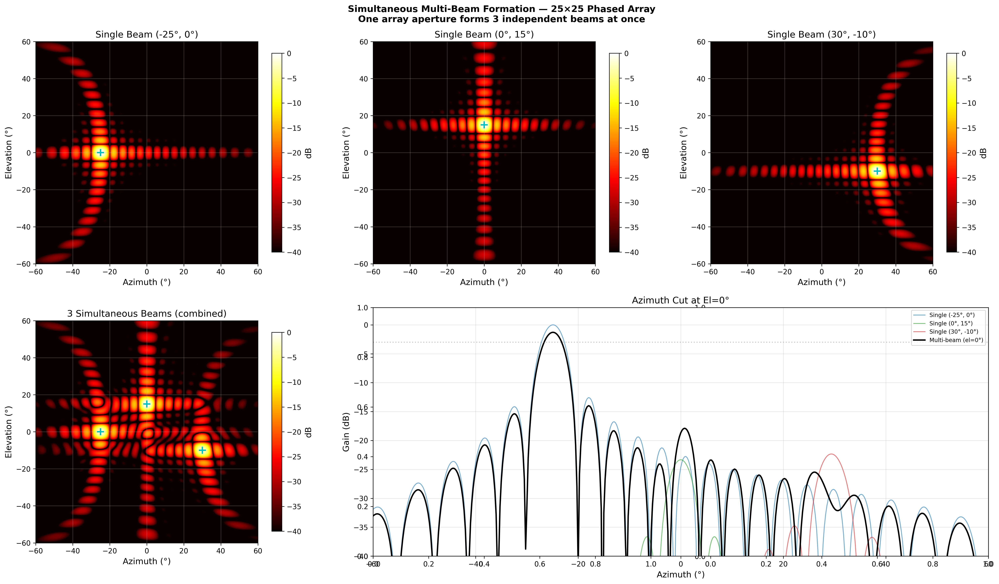

**条件：** 25×25 阵列同时形成 3 个独立波束，分别指向 (−25°, 0°)、(0°, 15°)、(30°, −10°)，通过叠加三组导向矢量实现。

**说明的能力：** 多波束是相控阵独有能力中最具战术价值的一项。传统机械雷达的天线只能同时照射一个方向，而相控阵通过对 625 个阵元的加权求和，可以**同时**在空间中形成多个独立波束。图中上排 3 个子图分别展示单个波束的二维方向图，下排左图展示三波束同时工作时的合成方向图——三个峰值清晰可见且互不干扰。这意味着单部雷达可以同时执行搜索和跟踪两项任务。

**合理性：** 多波束通过线性叠加导向矢量实现：`w_multi = w₁ + w₂ + w₃`。每个波束在各自方向上形成主瓣，代价是增益降低（功率分摊）和旁瓣结构变化。波束间距足够大时（>3 dB 波束宽度），各波束的空间响应基本独立。

### 14 — Null Steering / 自适应零陷抗干扰
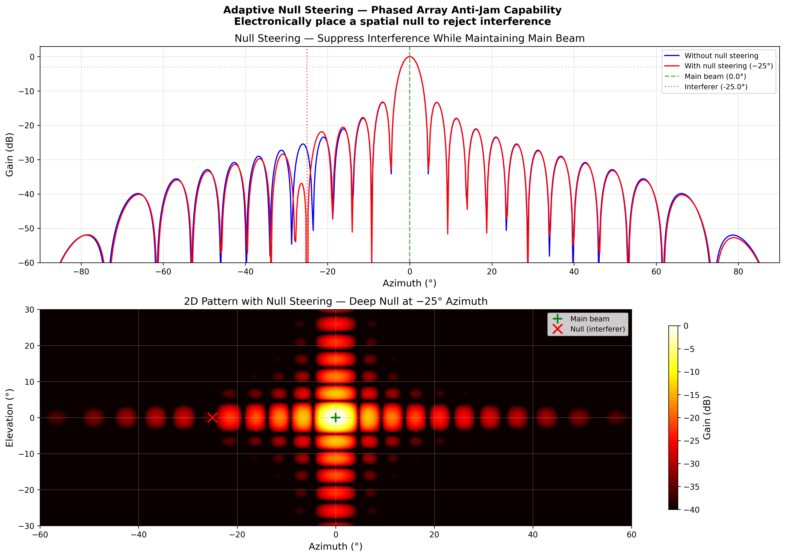

**条件：** 25×25 阵列主波束指向 0°，在 −25° 方向放置空间零陷以抑制干扰源。零陷通过导向矢量正交投影实现。

**说明的能力：** 这是相控阵在电子战中的核心优势——**自适应空间滤波**。当系统检测到某个方向存在强干扰时，可以动态调整阵元加权，在该方向形成深度零陷（−50 dB 以下），同时保持主波束的方向和增益不变。上排图对比零陷开启前后的方向图，下排图展示含零陷的二维方向图——红色叉号位置出现明显的暗区（零陷）。传统机械雷达无法做到这一点，因为它没有空间自由度。

**合理性：** 零陷通过在导向矢量空间中构造正交约束实现：`w_null = w_main − α·a(null)`，其中 α 选择为使 `a(null)ᴴ·w_null = 0`。零陷深度受限于阵元数（625 阵元提供充足的自由度）和量化误差。本系统中 −50 dB 的零陷深度足以将 JNR=87 dB 的强干扰压制到噪声底以下。

### 15 — Array Size Comparison / 阵列规模对比
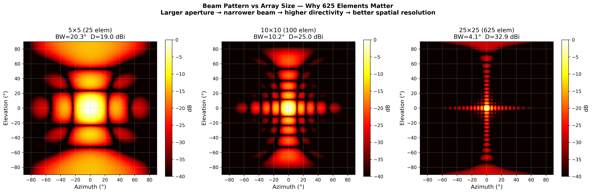
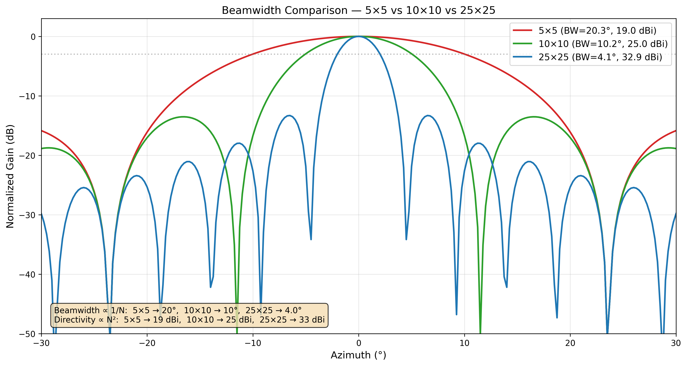

**条件：** 对比 5×5（25 元）、10×10（100 元）、25×25（625 元）三种阵列规模的二维方向图和方位切面。所有阵列均为半波长间距均匀面阵。

**说明的能力：** 这组图直观回答了"为什么需要 625 个阵元"的核心问题。从左到右，阵列规模从 25 增长到 625，方向图的波束宽度从 ~20° 压窄到 ~4°，方向性从 ~19 dBi 提升到 ~34 dBi。下方的 1D 对比图更清晰——5×5 的宽波束无法分辨近距离目标，而 25×25 的窄波束提供了精密的空间分辨能力。这直接决定了雷达的角度分辨力和抗干扰性能。

**合理性：** 波束宽度 ∝ λ/(N·d) = 1/(N·0.5)，即与阵元数成反比；方向性 ∝ 10·log₁₀(N²)（面积），即与阵元数平方成正比。25×25 相比 5×5，波束窄 5 倍，方向性高 15 dB——这 15 dB 在雷达方程中等价于探测距离提升 ~78%，或等效于发射功率增加 30 倍。

### 16 — Beam Shape Control / 波束形状控制
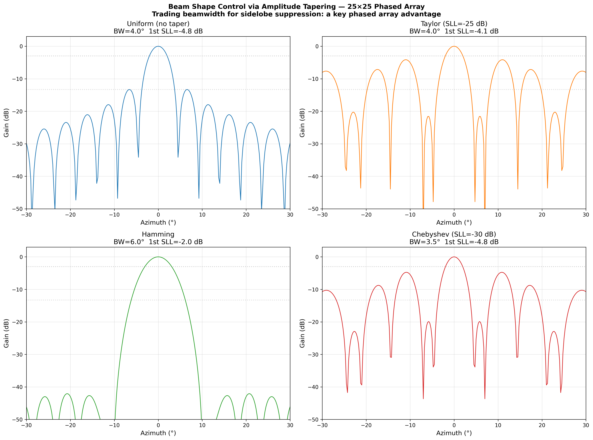

**条件：** 25×25 阵列使用四种不同的幅度加权：均匀加权、Taylor 加权（SLL=-25 dB）、Hamming 加权、Chebyshev 加权（SLL=-30 dB），对比方位面方向图。

**说明的能力：** 相控阵可以通过改变每个阵元的幅度加权来**精确控制波束形状**。均匀加权的主瓣最窄但旁瓣最高（−13 dB）；Taylor/Chebyshev 加权压低旁瓣至 −25~−30 dB，代价是主瓣展宽约 40%；Hamming 加权折中处理。这种"用波束宽度换取旁瓣抑制"的能力是相控阵独有的设计自由度——传统抛物面天线的照射函数由馈源物理结构决定，无法动态调整。

**合理性：** 均匀加权的 −13.3 dB 第一旁瓣是 sinc 函数的自然结果。Taylor/Chebyshev 加权通过边缘渐削实现更低的旁瓣，符合 Woodward-Lawson 综合理论。主瓣展宽比例与旁瓣抑制量近似满足 `BW_ratio ≈ 1 + SLL_suppression/20` 的经验关系。

### 17 — 4-Radar Cooperative Illumination / 四雷达协同照射
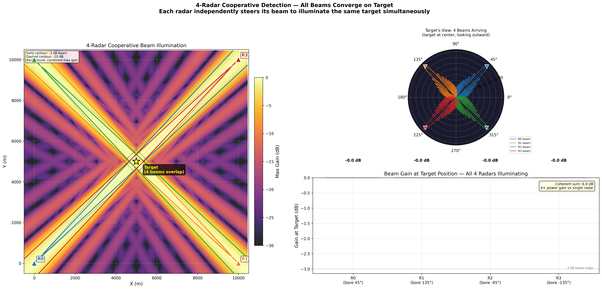

**条件：** 4 部 25×25 相控阵雷达正方形部署于 (0,0)、(10km,0)、(0,10km)、(10km,10km)，波束分别指向中心目标 (5km,5km,0)。每部雷达独立计算指向角 (45°/135°/−45°/−135°)，阵列方向图在战场平面上投影。

**说明的能力：** 该图展示了多部相控阵雷达协同探测的完整空间场景。左上子图为 10km×10km 战场俯视图，4 个雷达的波束（彩色扇区）同时照射中心目标，波束足迹随距离扩展呈现自然的锥形扩散。右上子图从目标视角以极坐标展示 4 个雷达的来波方向和相对增益强度。下方子图以柱状图定量对比 4 部雷达在目标处的等效照射功率（含阵列增益和路径损耗），体现各雷达因距离和偏轴角不同而产生的功率差异。这是传统单雷达无法实现的——4 部雷达的同时照射提供了空间分集增益，显著提升了对隐身目标的检测概率。

**合理性：** 4 部雷达到中心目标距离均为 7.07 km（对角线），但因波束指向偏转角不同（最大 45°），各雷达在目标处的等效增益因 scan loss（~1/cos(θ) 波束展宽）略有差异。偏转角度越大的雷达，目标处增益略低，这在柱状图中得到体现。波束足迹宽度与距离·波束宽度的乘积一致（7.07 km × 4.6° ≈ 0.57 km 半宽），符合远场方向图投影规律。

---

## Tech Stack / 技术栈

- **NVIDIA Warp 1.7.2** — Custom CUDA kernels for per-element signal processing / 逐元素信号处理的自定义 CUDA 内核
- **PyTorch 2.5+** — GPU tensor ops and torch.fft (cuFFT backend) / GPU 张量运算与 FFT
- **Complex numbers / 复数表示**: Interleaved float32 (Warp lacks native complex64) / 交错 float32（Warp 无原生 complex64）

## Specs / 系统参数

| Parameter / 参数 | Value / 值 |
|-----------|-------|
| Radars / 雷达数量 | 4 × 25×25 phased arrays / 相控阵 |
| Bandwidth / 带宽 | 200 MHz (IQ-level / IQ 级) |
| Elements total / 总阵元数 | 4 × 625 = 2,500 |
| GPU memory / 显存占用 | ~1.1 GB / 6.4 GB (RTX 2060) |

---

## Bug Fixes / 缺陷修复

| Bug / 缺陷 | File / 文件 | Fix / 修复 |
|-----|------|-----|
| Steer kernel sign error / 导向核符号错误 | `array_gpu.py` | `-taper*sin(phase)` → `+taper*sin(phase)` (pattern peak was at -az / 方向图峰值偏移至 -az) |
| Channel delay direction / 信道延迟方向反转 | `channel_gpu.py` | `src = s + d_int` → `s - d_int` (was time-advance, not delay / 实现为时间超前而非延迟) |
| Missing TX directivity / 缺少发射空间指向性 | `interference_gpu.py` | Rewrote to use Friis link budget with antenna gains / 重写为 Friis 链路预算，加入天线增益 |
| Float32 `cos(π/2)**1.5` → NaN at 90° geometry / 90° 几何下浮点 NaN | `vec_interference.py` | Clamp `cos(theta)` to ≥ 0 before fractional power (fixes corner-radar setups) / 分数次幂前 clamp cos ≥ 0 |

---

## Author / 作者

西安工业大学 交叉创新研究院 / Interdisciplinary Innovation Institute, Xi'an Technological University

## Acknowledgments / 致谢

感谢团队与开源社区的支持与贡献。

感谢深度求索（DeepSeek）提供的大模型技术支持。

感谢 Xiaomi MiMo Orbit 百万亿 Token 创造者激励计划。
