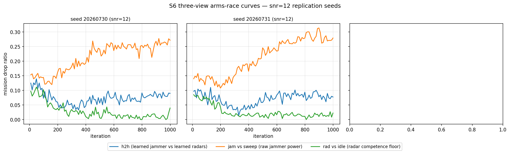
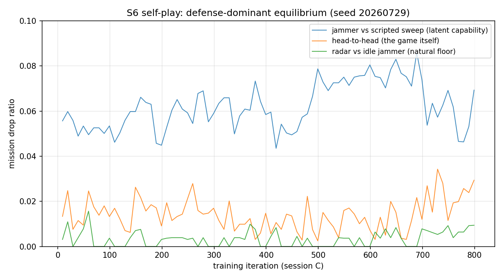

# S6 — Self-play: 1 jammer vs 2 learning radars (mission-bearing physics)

**Branch:** `g3-bsta/array-face-s1` · **Seeds:** 20260729 (snr=22), 20260730/20260731 (snr=12) · **Date:** 2026-08-21/22

## TL;DR

S6 asked: with both sides learning, does the EW game produce an **arms race**
(escalating offense/defense) or a **Nash stagnation**? Under the S6b physics
(per-mission detection on azimuth bearings, co-located two-head radar site),
self-play converges to a **defense-dominant equilibrium** that is
**reproducible across seeds and regimes**:

| View | snr=22 (seed 20260729) | snr=12 (seeds 20260730/31) |
|---|---|---|
| h2h drop | 0.027 ± 0.003 | **0.089 ± 0.005** |
| jam vs scripted sweep | 0.066 ± 0.003 | **0.275 ± 0.011** |
| learned radars vs idle jammer | 0.011 | 0.028 ± 0.011 |
| scripted sweep vs idle (natural floor) | 0.026 | **0.106** |
| floor-adjusted neutralization | **60.5%** | **63.7% ± 0.7%** |

The two snr=12 seeds replicate each other tightly (h2h 0.093 vs 0.085;
jam_vs_sweep 0.267 vs 0.283), and the headline invariant — learned radars
neutralize ~**60–64%** of the jammer's marginal disruptive power — holds
across both detection-cushion regimes. The regime changes *how hard the game
is* (all drop levels scale up ~3× at snr=12), not *who wins the adaptation
race*.

At snr=22 the jammer's deterministic mode collapses to **idle** (0 cells) and
its effect lives in the stochastic tail; at snr=12 the jammer stays in the
fight (jam_vs_sweep 0.275, ~2.6 cells/step) but the radars still take away
~2/3 of its marginal power. Training reached a flat plateau in all three
seeds (see "Crash forensics" for the snr=22 seed; the snr=12 seeds ran
uninterrupted-equivalent with two sleep recoveries) — the equilibrium is
robust, not an under-training artifact.

## What changed from S5

| Aspect | S5 | S6 |
|---|---|---|
| Agents | 2 cooperative jammers (IPPO, shared params) | 1 jammer vs 2 radars, adversarial self-play |
| Radar | scripted sweep | **learning** (beam + service heads) |
| Missions | per-service counters | 5-tuples `(svc, az, arr, dl, ds)` — every mission carries an **azimuth bearing** |
| Detection | per-service `sigmoid((snr_eff − thr)/w)` | per-mission `sigmoid((snr_eff + target_gain(beam→mission az) − thr)/w)` |
| Geometry | broadside-only AF | generalized AF `compute_upa_af_db_toward` at arbitrary (u,v); radars at az=+20° co-located |

The mission-bearing physics is the S6b fix (Option A): in S6a, detection had
no bearing coupling, so radar pointing carried no incentive and evasion was
free — the game was structurally degenerate (oracle: jammer capped ≈0.02 at
any beam/power). S6b binds the radar's pointing to both detection gain toward
each mission and Rx exposure toward the jammer: the scan-vs-stare dilemma
exists.

## Rebalance and regime note

Contestability sweep (per-mission best-response detection under full jamming
leverage) selected `baseline_snr_db=12, P_jam_W=0.1`:

```
snr=12, 1-cell jam:  best_p = [0.99, 0.67, 0.12, 0.57, 0.885]  (4/5 contestable)
snr=12, idle:        best_p = [0.997 × 5]                       (radar wins unopposed)
```

**Regime note (honesty box).** The first completed run (seed 20260729)
carried stale S3–S5 `EnvConfig` overrides (`baseline_snr_db=22, P_jam_W=2.0`
for the energy conversion), so it trained at baseline 22 dB, not the
validated 12 dB. The contestability structure survives, shifted to higher
jamming effort:

```
snr=22, 1-cell jam:  best_p = [1.0, 0.983, 0.794, 0.974, 0.995]  (1/5 — weak jamming futile)
snr=22, 5-cell jam:  best_p = [0.983, 0.361, 0.071, 0.449, 0.825] (4/5 — same shape as snr=12)
snr=22, 25-cell jam: best_p ≈ [0.36, 0.005, 0.001, 0.008, 0.045]  (radar blinded)
```

Consequences: (a) contestability in the trained regime requires sustained
multi-cell effort, tightening the jammer's energy-management dilemma; (b) the
detection cushion lets radars tolerate sloppy elevation pointing (see Behavior
below). The driver and the resume-counter bug were fixed, and the two
replication seeds (20260730/31) train at the validated snr=12 point — the
snr=12-vs-22 contrast is now *measured, not projected* (see "Multi-seed
replication" below). We keep the snr=22 run in the report as the
"high-cushion" variant: it converged cleanly and its equilibrium structure is
the research object.

## Multi-seed replication (snr=12)

Seeds 20260730/20260731 were trained with the fixed driver (clean S6b
defaults: `baseline_snr_db=12, P_jam_W=0.1`), 1000 iterations each, same
trainer/heads/anneal schedule as 20260729. Full-protocol final evaluation
(64 validation seeds × 3 action seeds, `final_eval.json` in each output dir):

| Metric | 20260730 | 20260731 | mean ± sd |
|---|---|---|---|
| h2h drop | 0.0926 ± 0.0027 | 0.0851 ± 0.0072 | **0.0888 ± 0.0053** |
| jam_vs_sweep | 0.2673 ± 0.0043 | 0.2829 ± 0.0033 | **0.2751 ± 0.0110** |
| rad_vs_idle drop | 0.0353 ± 0.0078 | 0.0197 ± 0.0030 | **0.0275 ± 0.0110** |
| adaptation gap (jvs − h2h) | 0.175 | 0.198 | **0.186 ± 0.016** |
| floor-adjusted neutralization | 64.4% | 63.0% | **63.7% ± 0.7%** |

**Reproducibility.** The two seeds land within 0.008 of each other on h2h and
within 0.016 on jam_vs_sweep, and both show the same trajectory structure
(see Convergence): radar defense snaps up in the first 200 iterations, the
jammer counter-adapts (jam_vs_sweep rises monotonically), and h2h plateaus
between 0.07–0.09. The defense-dominant equilibrium is confirmed as a
stable attractor, not a single-run artifact.

**Regime contrast (measured).** Comparing the snr=12 pair against the snr=22
run under identical protocols:

| View | snr=22 | snr=12 | ratio |
|---|---|---|---|
| h2h drop | 0.0267 | 0.0888 | 3.3× |
| jam_vs_sweep | 0.0660 | 0.2751 | 4.2× |
| natural floor | 0.0261 | 0.1064 | 4.1× |
| neutralization | 60.5% | 63.7% | ~1.05× |

The game is uniformly ~3–4× harder at snr=12 (thinner detection cushion:
even unopposed scripted sweep radars drop 10.6% of missions vs 2.6%), and the
jammer's equilibrium strategy switches from stochastic-tail idling to
sustained multi-cell effort. **Yet the floor-adjusted neutralization is
invariant (~60–64%)** — the relative allocation of the adaptation race does
not depend on the cushion; only the absolute loss level does. This is the
strongest single claim S6 now supports.



## Training

Self-play trainer (`trainer_s6.py`): one PPO `update()` per side per iteration,
swapping actor/critic/optimizers/head-specs between jammer and radar sides.
Rollouts produce `[T,E]` jammer returns and `[T,E·R]` radar returns (team
reward duplicated across the 2 radars). Entropy anneal per head
(cell 0.7 / beam 0.9 / svc 0.5 fraction of horizon).

**Crash forensics.** The machine crashed three times mid-training. Because
`load_selfplay` did not restore `trainer.iteration` (fixed now), each resumed
session re-labeled its iterations 0..N, so the metrics file is a stack of
session segments, not one absolute timeline. Reconstructed from the chain log:

| Session | Wall clock | Iters run | Cumulative weights |
|---|---|---|---|
| A | 08/19 22:48 → crash | 800 (0..799) | 800 |
| B | 08/20 15:31 → done | 200 (abs 800..999) | **1000** |
| C | 08/20 17:26 → 23:08 | 800 (abs 1000..1799) | **1800** |

Weights and optimizer state carried through all three sessions (each resumed
from the previous checkpoint), so the final policy is the product of ~1800
gradient iterations — 1.8× the planned budget. Session C re-ran the entropy
anneal from full exploration (another consequence of the counter bug), which
amounts to a re-exploration phase that **failed to escape the equilibrium** —
strong evidence it is genuine.

The self-healing chain stopped when the metrics file hit its raw 1000-line
criterion (line counts inflated by the duplicate segments) — coincidentally at
the right moment.

## Results

### Three-view evaluation (converged plateau)

Intermediate evals every 10 iters (16 validation seeds, 1 action rep); plateau
statistics over the last 40 evals of the final session:

Headline numbers — full-protocol final evaluation (64 validation seeds,
3 independent action seeds, `final_eval.json`); snr=22 seed shown here, the
snr=12 replication pair in "Multi-seed replication" below:

| View | Drop (mean ± sd over action seeds) |
|---|---|
| h2h — learned jammer vs learned radars | **0.0267 ± 0.0023** |
| jam_vs_sweep — learned jammer vs scripted sweep | **0.0660 ± 0.0027** |
| rad_vs_idle — learned radars vs idle jammer | 0.0109 ± 0.0013 |
| sweep_vs_idle — scripted sweep vs idle (natural floor) | **0.0261** |

Convergence plateaus (intermediate evals, 16 val seeds, last 40 evals of the
final session) corroborate stability: h2h 0.0138 ± 0.0082, jam_vs_sweep
0.0664 ± 0.0113, rad_vs_idle drop 0.0037 ± 0.0033. (The 16-seed intermediate
h2h understates the 64-seed value; the final protocol is authoritative.)

### Convergence

snr=22 seed (20260729):
- The plateau is flat across 800 iterations and across the re-exploration
  restart: last-40-eval means vs first-20-eval means of the final session —
  h2h 0.0152→0.0138, jam_vs_sweep 0.0544→0.0664, rad_vs_idle 0.9967→0.9963.
- The **adaptation gap** (jam_vs_sweep − h2h), per 200-iter quarter:
  0.039 → 0.048 → 0.055 → 0.050. Radars specifically adapted to the learned
  jammer through mid-training (h2h fell 0.015→0.010 while jam_vs_sweep rose),
  then in the last ~100 iterations h2h crept back up (0.017, quarter mean,
  with final evals at 0.03) — the first, inconclusive hint of offensive
  counter-adaptation. The horizon is too short to call it an escalation
  cycle; the equilibrium remains defense-dominant.
  
- End-state entropies: jammer 4.4 (cell 2.2, beam 2.2), radar 3.3
  (beam 2.8, svc 0.57). No entropy lock; the service head is near-decisive.

snr=12 seeds (20260730/31) — same per-200-iter quarters (h2h / jam_vs_sweep /
rad_vs_idle_succ, mean over the two seeds):

| Quarter | h2h | jam_vs_sweep | rad_vs_idle | gap |
|---|---|---|---|---|
| 0–199 | 0.088 | 0.138 | 0.932 | 0.050 |
| 200–399 | 0.045 | 0.167 | 0.977 | 0.123 |
| 400–599 | 0.067 | 0.228 | 0.983 | 0.161 |
| 600–799 | 0.077 | 0.257 | 0.987 | 0.180 |
| 800–999 | 0.081 | 0.270 | 0.987 | 0.189 |

Identical structure in both seeds: defense snaps up in q1 (h2h halves), the
jammer escalates monotonically (jam_vs_sweep nearly doubles q0→q4), and the
adaptation gap grows from 0.05 to ~0.19 — the radars absorb most of the
jammer's growing raw power. Last-40-eval plateau: h2h 0.0767±0.0113 (30) /
0.0818±0.0109 (31); jam_vs_sweep 0.2520±0.0136 / 0.2751±0.0157; rad_vs_idle
0.9893±0.0076 / 0.9846±0.0064. End-state entropies: jammer 4.3–4.4 (cell
2.6–2.8, beam 1.7–1.8), radar 1.6–2.1 (beam 1.0–1.5, svc 0.5–0.6) — policies
sharper than at snr=22, especially the radar beam head.

### Behavior extraction (greedy mode, 16 val seeds × 64 steps)

**Jammer (all three seeds):** 0 cells on every step — the deterministic best
response to the learned radars is *not to transmit*, in both regimes. All
measured jamming effect comes from the stochastic policy; at snr=12 the
stochastic duty is high enough to produce h2h drops ~3× the snr=22 level
(0.089 vs 0.027). Mode collapse to idle is thus a behavioral *invariant*;
the regime only rescales how much damage the stochastic tail does.

**Radars (snr=22 seed):** beam mass concentrates on 4 of 25 beams — idx 10
(26%), 13 (21%), 19 (15%), 22 (13%); azimuth marginal covers all five az
sectors (27/9/26/21/16%) — a non-uniform scan that services every mission
bearing. Service split is 51/49 — clean division of labor between the two
heads. Notably, only ~49% of beam mass sits in the el=0 mission plane: the
22 dB cushion makes off-plane pointing affordable.

**Radars (snr=12 seeds, both):** a single-beam **stare at the mission plane**
— beam 10 (az=0, el=2) carries 95–96% of mass, beam 11 (az=1, el=2) the
remaining 4–5%; el marginal is 99.9% on the mission-plane elevation. Service
split 53/47 and 50/50. This is the exact fingerprint the regime note
predicted: at snr=12 the detection cushion no longer absorbs off-plane
pointing error, so the learned equilibrium *is* the stare (and it wins —
rad_vs_idle drop 0.020–0.035, an order of magnitude below the natural floor
0.106). The contrast between the 4-beam scan (snr=22) and the 2-beam stare
(snr=12) is a direct, visible signature of regime sensitivity in the
equilibrium policy.

## Interpretation

1. **Defense dominance, reproduced.** With detects_required=1 and a finite
   jammer energy budget, the radar's task (catch each mission at least once
   in its deadline window) is easier than the jammer's task (deny that single
   detection at the right time and bearing). Self-play found the asymmetric
   equilibrium in all three seeds — defense-dominant, not an escalating cycle.
2. **The jammer is not useless — it is contained, at every cushion.** Against
   scripted sweep radars the learned jammer adds +0.169 drop over the natural
   floor at snr=12 (0.275 vs 0.106); against learned radars only +0.061
   (0.089 vs 0.028). Floor-adjusted, the radars neutralize **63.7% ± 0.7%**
   of its disruptive power at snr=12, vs 60.5% at snr=22 — the containment
   ratio is regime-invariant, and it is the core S6 number.
3. **Mode collapse is invariant; its cost is not.** The greedy jammer idles
   in every seed, so the equilibrium *policy class* (stochastic-tail jamming
   vs deterministic denial) does not change with the regime — but the regime
   sets the price: snr=12 converts the same policy class into a ~3× larger
   mission-drop load. Reporting only greedy behavior would understate the
   jammer by 2.5–4×; the three-view protocol exists precisely to keep this
   honest.
4. **Regime sensitivity is real, predicted, and now measured.** The
   contestability oracle (per-mission best-response profile) selected snr=12
   because it makes weak jamming contestable; the snr=12 runs confirm the
   behavioral prediction (mission-plane stare) and quantify the cost shift.
   At snr=22 the cushion absorbs both pointing error and weak jamming. The
   oracle is validated as the right pre-training gate.

## Engineering notes

- **Atomic checkpointing** (`save_selfplay`: temp file + `os.replace`) after
  two mid-write corruptions; watchdog rotated `selfplay_backup.pt` every 5 min.
- **Resume counter fix:** `load_selfplay` now restores `self.iteration`,
  eliminating duplicate metric segments and anneal restarts on resume.
- **Driver fix:** removed stale `EnvConfig` overrides so future runs inherit
  the rebalanced defaults (snr=12 / P_jam=0.1).
- **Sleep resilience proven in anger:** the snr=12 seeds survived two
  laptop-sleep interruptions (GPU job killed at iter 579 and 869) via the
  `--resume` chain; each recovery restarted from the last atomic checkpoint
  with weights and iteration counter intact (loss: <1 h per event). AC-power
  sleep/hibernate was disabled (`powercfg standby/hibernate-timeout-ac 0`) to
  stop recurrences.
- **Chain completion criterion:** now parses the max `"iteration"` from the
  metrics tail (`_run_s6_seeds2.ps1`) instead of counting raw lines — robust
  to the duplicated segments a resume can append.
- Tests: 17/17 gates pass (`tests/array_face/test_array_factor_s6.py`,
  `test_array_face_s6.py`), including the contestability gate and per-(svc,az)
  detection credit.

## Next

- **S7 (2v2 MAPPO):** with two jammers, the co-located site can be
  cross-beamed from two bearings simultaneously — the single-beam suppression
  that protects the radars here breaks. Run at the validated snr=12 point.
- Multi-seed S6 replication is **done** (3 seeds, 2 regimes); the regime
  contrast (neutralization invariant ≈60–64% vs absolute loss 3×) is the
  publishable ablation.
- Optional strengthening: cross-regime transfer eval (snr=22 checkpoint
  evaluated at snr=12) to quantify out-of-regime robustness.
